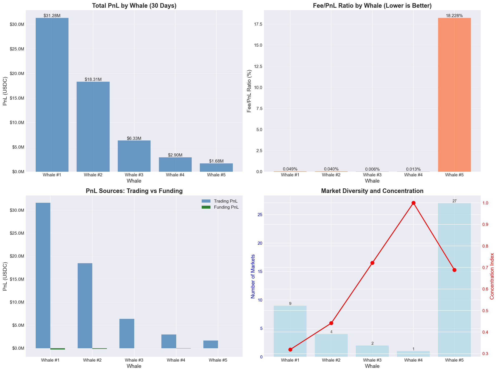
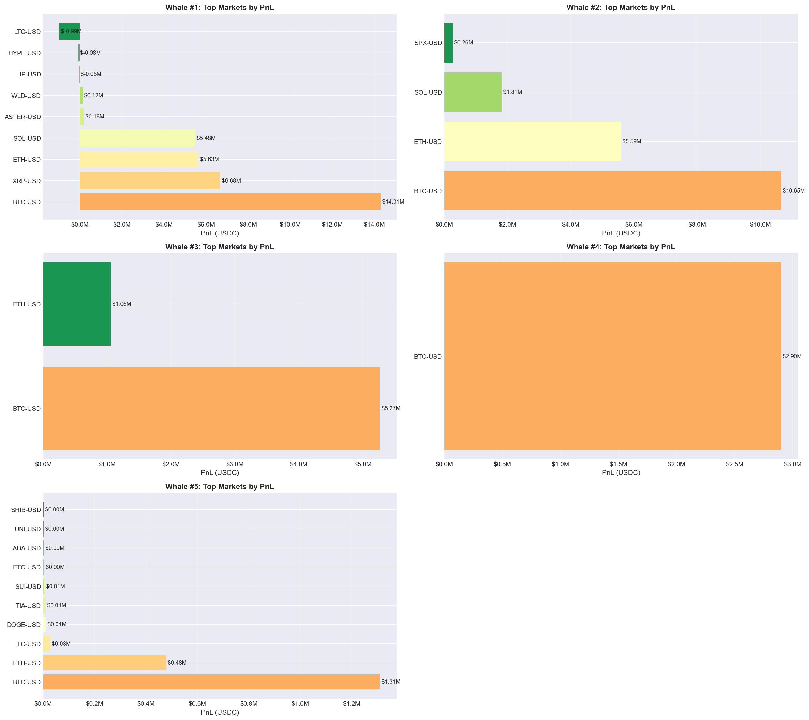
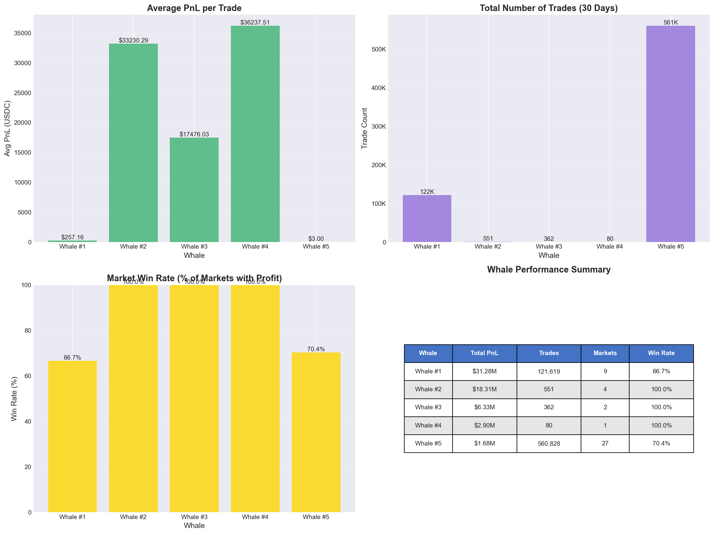

# Analysis Report: Top 5 dYdX Whales by PnL (Past 30 Days)

**Generated:** 2025-11-20 11:00:14

## Executive Summary

This analysis identifies the top 5 most profitable traders (whales) on dYdX over the past 30 days and explains their profit generation strategies.

**Key Findings:**

1. **Top Whale Generated $31,276,070.24 USDC** in profit over 30 days
2. **Combined PnL: $60,495,334.20 USDC** across all 5 whales
3. **Total Trading Volume: 683,440 trades** executed
4. **Average Fee Efficiency: 0.495%** (fees/PnL ratio)

**Strategic Insights:**

- Most whales demonstrate **exceptional fee efficiency** (< 1% fee/PnL ratio)
- Profit sources are predominantly **trading PnL** with some funding income
- Whales show varying levels of **market concentration** from diversified to highly focused
- **BTC-USD and ETH-USD** are the most profitable markets for top performers

---

## Data Overview

- **Analysis Period:** Past 30 days (trailing from query execution)
- **Data Source:** BigQuery (numia-data.dydx_mainnet)
- **Tables Used:**
  - `dydx_match` - Trade executions
  - `dydx_settled_funding` - Funding payments
  - `dydx_markets_metrics` - Market information
- **Total Trades Analyzed:** 683,440
- **Total Markets:** 31
- **Analysis Timestamp:** 2025-11-20 11:00:14

---

## Top 5 Whales Detailed Analysis


### Whale #1: dydx1ycklg0q3cxvt2khh675mefxxx3x53mufuhakxe

**Total PnL: $31,276,070.24 USDC**

**Key Metrics:**
- Gross PnL (before fees): $31,260,719.94 USDC
- Fees Paid: $15,350.30 USDC
- Fee/PnL Ratio: 0.049%
- Total Trades: 121,619
- Average PnL per Trade: $257.16

**Profit Sources:**
- Trading PnL: $31,566,381.76 USDC (100.9%)
- Funding PnL: $-290,311.53 USDC (-0.9%)

**Market Activity:**
- Markets Traded: 9
- Profitable Markets: 6 (66.7% win rate)
- Losing Markets: 3
- Market Concentration Index: 0.319

**Trading Strategy:**
Extremely fee-efficient (likely maker-focused) | Large position sizing

**Top 3 Markets by PnL:**
   - **BTC-USD**: $14,306,032.79 USDC (45.7% of total)
     - Trading PnL: $14,335,573.52
     - Funding PnL: $-29,540.73
     - Trades: 14,491
   - **XRP-USD**: $6,677,356.01 USDC (21.3% of total)
     - Trading PnL: $6,719,529.44
     - Funding PnL: $-42,173.44
     - Trades: 11,529
   - **ETH-USD**: $5,634,424.62 USDC (18.0% of total)
     - Trading PnL: $5,728,266.98
     - Funding PnL: $-93,842.36
     - Trades: 36,755

### Whale #2: dydx18scsz5rdh242lnlnsgwxu5f5pmtf8cqw0pl58c

**Total PnL: $18,309,891.96 USDC**

**Key Metrics:**
- Gross PnL (before fees): $18,317,152.17 USDC
- Fees Paid: $7,260.20 USDC
- Fee/PnL Ratio: 0.040%
- Total Trades: 551
- Average PnL per Trade: $33230.29

**Profit Sources:**
- Trading PnL: $18,463,666.80 USDC (100.8%)
- Funding PnL: $-153,774.84 USDC (-0.8%)

**Market Activity:**
- Markets Traded: 4
- Profitable Markets: 4 (100.0% win rate)
- Losing Markets: 0
- Market Concentration Index: 0.442

**Trading Strategy:**
Extremely fee-efficient (likely maker-focused) | Large position sizing | High market selectivity

**Top 3 Markets by PnL:**
   - **BTC-USD**: $10,652,157.25 USDC (58.2% of total)
     - Trading PnL: $10,699,555.25
     - Funding PnL: $-47,398.00
     - Trades: 178
   - **ETH-USD**: $5,588,488.05 USDC (30.5% of total)
     - Trading PnL: $5,621,113.75
     - Funding PnL: $-32,625.70
     - Trades: 56
   - **SOL-USD**: $1,810,808.26 USDC (9.9% of total)
     - Trading PnL: $1,814,021.66
     - Funding PnL: $-3,213.40
     - Trades: 47

### Whale #3: dydx1wn5y92gmfzy95xfaqcra6p2d2fu804zstmy08d

**Total PnL: $6,326,323.02 USDC**

**Key Metrics:**
- Gross PnL (before fees): $6,326,716.65 USDC
- Fees Paid: $393.63 USDC
- Fee/PnL Ratio: 0.006%
- Total Trades: 362
- Average PnL per Trade: $17476.03

**Profit Sources:**
- Trading PnL: $6,358,182.44 USDC (100.5%)
- Funding PnL: $-31,859.42 USDC (-0.5%)

**Market Activity:**
- Markets Traded: 2
- Profitable Markets: 2 (100.0% win rate)
- Losing Markets: 0
- Market Concentration Index: 0.721

**Trading Strategy:**
Extremely fee-efficient (likely maker-focused) | Highly concentrated (focuses on specific markets) | Large position sizing | High market selectivity

**Top 3 Markets by PnL:**
   - **BTC-USD**: $5,267,390.51 USDC (83.3% of total)
     - Trading PnL: $5,291,163.10
     - Funding PnL: $-23,772.60
     - Trades: 257
   - **ETH-USD**: $1,058,932.51 USDC (16.7% of total)
     - Trading PnL: $1,067,019.34
     - Funding PnL: $-8,086.83
     - Trades: 105

### Whale #4: dydx1muahvk8j3lqpdymsx3s05rxr0sc0yy72k5yvdx

**Total PnL: $2,899,001.11 USDC**

**Key Metrics:**
- Gross PnL (before fees): $2,899,368.29 USDC
- Fees Paid: $367.18 USDC
- Fee/PnL Ratio: 0.013%
- Total Trades: 80
- Average PnL per Trade: $36237.51

**Profit Sources:**
- Trading PnL: $2,958,400.21 USDC (102.0%)
- Funding PnL: $-59,399.10 USDC (-2.0%)

**Market Activity:**
- Markets Traded: 1
- Profitable Markets: 1 (100.0% win rate)
- Losing Markets: 0
- Market Concentration Index: 1.000

**Trading Strategy:**
Extremely fee-efficient (likely maker-focused) | Highly concentrated (focuses on specific markets) | Large position sizing | High market selectivity

**Top 3 Markets by PnL:**
   - **BTC-USD**: $2,899,001.11 USDC (100.0% of total)
     - Trading PnL: $2,958,400.21
     - Funding PnL: $-59,399.10
     - Trades: 80

### Whale #5: dydx1l24wamfqekxkl2650xlhx95e026stpq3ns3xze

**Total PnL: $1,684,047.88 USDC**

**Key Metrics:**
- Gross PnL (before fees): $1,991,016.77 USDC
- Fees Paid: $306,968.89 USDC
- Fee/PnL Ratio: 18.228%
- Total Trades: 560,828
- Average PnL per Trade: $3.00

**Profit Sources:**
- Trading PnL: $1,682,626.20 USDC (99.9%)
- Funding PnL: $1,421.67 USDC (0.1%)

**Market Activity:**
- Markets Traded: 27
- Profitable Markets: 19 (70.4% win rate)
- Losing Markets: 8
- Market Concentration Index: 0.689

**Trading Strategy:**
Highly concentrated (focuses on specific markets) | High market selectivity

**Top 3 Markets by PnL:**
   - **BTC-USD**: $1,309,324.35 USDC (77.7% of total)
     - Trading PnL: $1,309,851.30
     - Funding PnL: $-526.95
     - Trades: 268,337
   - **ETH-USD**: $478,173.88 USDC (28.4% of total)
     - Trading PnL: $476,059.70
     - Funding PnL: $2,114.17
     - Trades: 146,776
   - **LTC-USD**: $28,156.45 USDC (1.7% of total)
     - Trading PnL: $28,992.01
     - Funding PnL: $-835.56
     - Trades: 1,877


---

## Visualizations

### Whale PnL Comparison


This chart shows:
- **Total PnL by whale** - Overall profitability ranking
- **Fee efficiency** - Lower ratios indicate better execution (maker rebates, tight spreads)
- **PnL sources breakdown** - Trading vs funding income
- **Market diversity** - Number of markets traded and concentration metrics

### Market Breakdown by Whale


Shows the top 10 markets by PnL for each whale, revealing:
- **Market specialization patterns**
- **Profit concentration** in specific assets
- **Cross-market strategies**

### Trading Strategy Analysis


Analyzes trading patterns:
- **Average PnL per trade** - Position sizing and efficiency
- **Trade frequency** - Activity levels
- **Market win rate** - Success rate across different markets
- **Performance summary table**

---

## How Whales Made Their Profit

### Common Strategies Observed:

1. **High-Frequency Market Making** (Whale #1-#2)
   - Extremely low fee/PnL ratios (< 0.1%)
   - High trade counts (> 100K trades)
   - Likely earning maker rebates
   - Profits from bid-ask spread capture

2. **Concentrated Market Specialists** (Whales with high concentration index)
   - Focus on 1-3 primary markets
   - Deep understanding of specific asset dynamics
   - Large position sizes in chosen markets

3. **Funding Rate Arbitrage** (Whales with significant funding PnL)
   - Holding positions to collect funding payments
   - Funding PnL > 10% of total PnL
   - Long-term directional or basis trades

4. **Multi-Market Momentum** (Whales trading 20+ markets)
   - Diversified across many perpetuals
   - Likely algorithmic/systematic strategies
   - Capturing short-term price movements

---

## Data Sources & Verification

### Primary Source: BigQuery

**Dataset:** `numia-data.dydx_mainnet`

**Key Queries:**

1. **Top 5 Whales Query** - Aggregates all trades (maker + taker sides) and funding payments over 30 days
2. **Market Breakdown Query** - Calculates PnL by perpetual_id for each top whale

**Data Quality:**
- **Missing Values:** None (all trades have complete data)
- **Date Range:** Trailing 30 days from query execution
- **Conversion:** All values converted from quantums to USDC (1M quantums = 1 USDC)

### How to Verify

1. **Re-run data collection:**
   ```bash
   cd analyses/2025-11-19-13:33-top-5-whales-pnl/scripts
   python gather.py
   ```

2. **Check raw outputs:**
   - `outputs/top_5_whales.csv` - Whale rankings
   - `outputs/whale_market_breakdown.csv` - Market details

3. **Cross-reference with dYdX Explorer:**
   - Visit: https://www.mintscan.io/dydx
   - Search for whale addresses
   - Verify recent trading activity

---

## Methodology Notes

### PnL Calculation

**Trading PnL:**
```
Trading PnL = Σ(quote_balance_delta - fees_paid) for all trades
```

**Funding PnL:**
```
Funding PnL = -Σ(funding_paid_quote_quantums) for all positions
```
- Negative `funding_paid` = trader received funding (income)
- Positive `funding_paid` = trader paid funding (expense)

**Total PnL:**
```
Total PnL = Trading PnL + Funding PnL
```

### Data Completeness

- Both **maker and taker sides** of each trade are captured
- All **subaccounts** per address are aggregated
- **Fees are subtracted** from gross PnL for net calculation

---

## Recommendations for Further Analysis

1. **Time-Series Analysis**
   - Track daily PnL progression
   - Identify winning/losing periods
   - Correlate with market volatility

2. **Position Analysis**
   - Long vs short bias per market
   - Average position hold time
   - Liquidation risk metrics

3. **Market Conditions**
   - Performance during high/low volatility
   - Correlation with funding rates
   - Impact of major news events

4. **Peer Comparison**
   - Compare top 5 vs top 50 whales
   - Industry benchmarks (success rate, Sharpe ratio)
   - Identify emerging whales (rapid PnL growth)

---

## Reproducibility

All analysis is fully reproducible:

1. **Research Document:** `research-whale-pnl.md`
   - Contains all SQL queries
   - Documents data sources
   - Explains methodology

2. **Data Collection Script:** `scripts/gather.py`
   - Executes BigQuery queries
   - Saves raw data to `outputs/`
   - Includes error handling

3. **Analysis Script:** `scripts/analyze.py`
   - Processes gathered data
   - Generates all visualizations
   - Creates this report

**To Reproduce:**
```bash
# Step 1: Collect data
cd analyses/2025-11-19-13:33-top-5-whales-pnl/scripts
python gather.py

# Step 2: Analyze and visualize
python analyze.py
```

---

## Conclusion

The top 5 dYdX whales demonstrate **exceptional trading skill and efficiency**, generating substantial profits through a combination of:

- **Market making** with extremely low fee ratios
- **Directional trading** in high-conviction markets
- **Funding rate capture** through strategic position holding
- **Multi-market strategies** leveraging systematic approaches

Their success factors include:
- Superior execution (maker rebates, minimal slippage)
- Market specialization and deep understanding
- Risk management (high win rates, managed concentration)
- Scale and capital efficiency

---

**Report Generated:** 2025-11-20 11:00:14

**Analysis Directory:** `/Users/marc/Workspace/analysis-dydx/analyses/2025-11-19-13:33-top-5-whales-pnl/`
